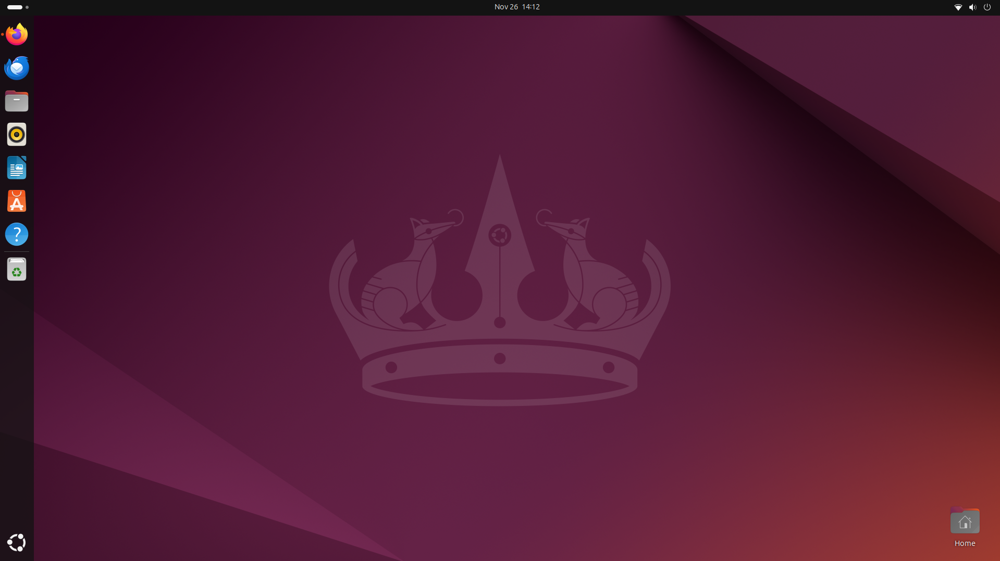
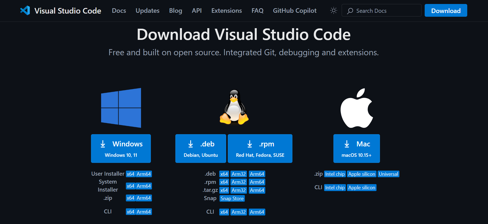
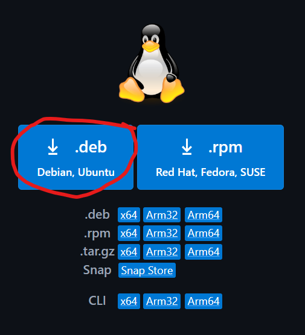
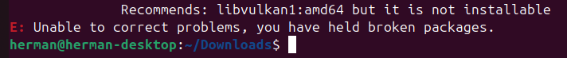
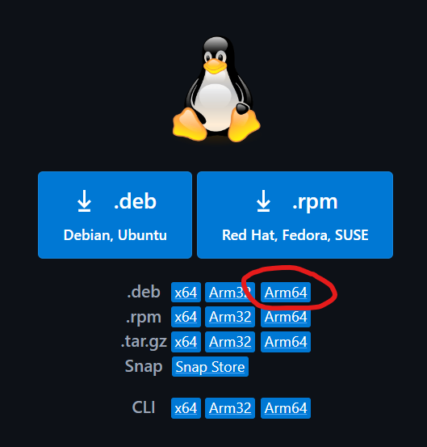
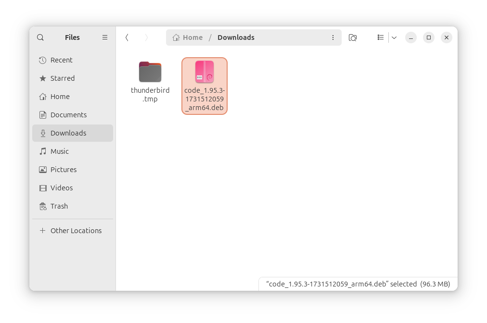

# Step-by-Step Tutorial for downloading VSCode on Ubuntu

 
1.
Start med å åpne terminalen via "**windows keyen**" og skriv "**terminal**" eller bare gjør **Ctrl+Alt+T**.

2.
Nå skriver du følgende kommando, som sjekker om du har alle updatsa du trenger.

    sudo apt update

3.
Skriv inn denne kommandoen for å laste ned updatsa

    sudo apt upgrade

4.
Gå inn her https://code.visualstudio.com/Download

5.
Et par versjoner popper opp, men du skal laste ned **.deb** filen for ubuntu

6.
Den blir automatisk lastet ned til **Downloads/**, med mindre du endrer det. Gå tilbake til **Terminal** og skriv inn disse kommandoene.

    cd Downloads/

    sudo apt install ./<filen>

(shortcut for filen er **./c** så trykk **tabulator**, dette burde finne filen)

Om du får feil melding som ser slik ut,

så kan du av avinstallere **.deb** filen du lastet ned til **Downloads/**. (Dette vil gjøre fiksen lettere når du skal laste ned en ny fil, finn lett fram ved bruk av **Windows Keyen** og skriv inn **Downloads** så **Enter Keyen**.)

7.
Gå tilbake til https://code.visualstudio.com/Download å last ned **.deb arm64** versjonen. Ser slik ut.

8.
Denne vil også bli lastet ned til **Downloads/**

9.
Gå tilbake til **Terminal** og skriv inn samme som istad.

    sudo apt install ./<filen>

    eks. 
    sudo apt install ./code_1.95.3-1731512059_arm64.deb

Nå skal alt være bra og du kan åpne VSCode i **Show Apps** nederst i venstre, eller skrive inn kommandoen som vises under, i **Terminal**.

    Code .
